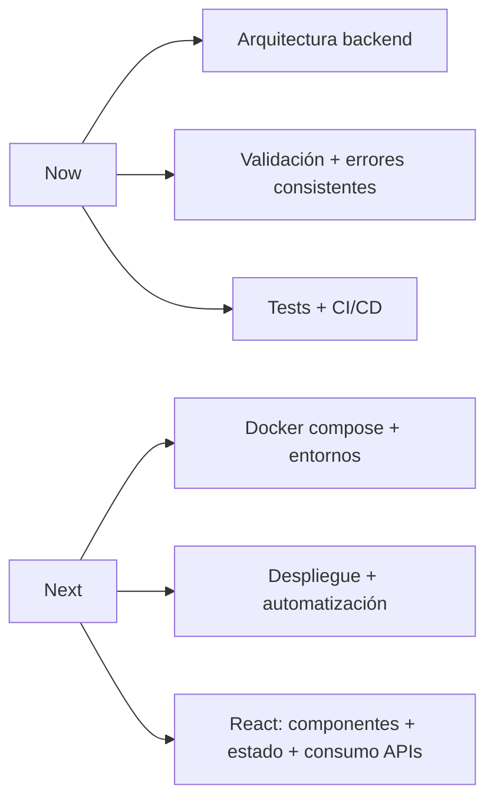

<!--
TIP: Para usar esto como *Profile README* en GitHub:
1) Crea un repositorio llamado exactamente: nicolas-silva
2) Marca "Add a README" y pega este contenido en README.md
-->

  

  

  
  
  
  <!-- Sustituye TU_LINKEDIN por tu URL real -->
  

---

## 🧬 Quién soy (en 15 segundos)
- Estudiante de **2º DAW** y **Técnico SMR**.
- Me gusta el **backend**: diseñar APIs, autenticar, validar, estructurar y mantener.
- Mi obsesión: que un proyecto sea **usable** y que el código quede **mantenible**.
- Fuera del teclado: deporte + nutrición → foco constante.

## 🧭 Manifiesto (modo profesional)
- **Claridad > complejidad** (si no se entiende, no escala).
- **Producto > demo** (que funcione para alguien real).
- **Automatización** cuando reduzca errores (scripts, Docker, CI).
- **Feedback** como motor: iterar rápido y documentar decisiones.

## ⚙️ Stack y herramientas

  

  
<b>🧰 Toolbox (click para desplegar)</b>

- **Frontend:** HTML, CSS, JavaScript, Bootstrap, React (en progreso)
- **Backend:** Laravel, Django/Flask, Node.js
- **Datos:** MySQL, PostgreSQL, SQLite
- **Dev:** Git, Docker
- **Cloud:** nociones de AWS/Azure

---

## 🚀 Proyectos (selección)

### CRUD‑Breeze
- **Qué es:** práctica con Laravel Breeze para gestionar **vehículos** y **usuarios**.
- **Enfoque:** auth, validación, estructura, buenas respuestas.
- **Stack:** Laravel + MySQL.

### MiPortfolio
- **Qué es:** página personal para mostrar proyectos y CV.
- **Enfoque:** responsive, limpio, rápido.
- **Stack:** HTML + CSS + JS.

### App‑Notas
- **Qué es:** API REST para gestionar notas.
- **Enfoque:** endpoints consistentes, HTTP correcto, persistencia ligera.
- **Stack:** Node.js + SQLite.

  
<b>🪪 “Project Cards” (actívalo cuando tus repos existan con esos nombres)</b>

<!--
Si el nombre del repo no coincide, cambia repo=...
-->

  
  

  

---

## 🧪 Radar de mejora (Now / Next)

---

## 📊 Métricas (porque los números también cuentan)

  
  

  

  

---

## 🤝 Colaboración

## 📫 Contacto
- GitHub: https://github.com/nicolas-silva
- Email: nsilvacremona@gmail.com
- LinkedIn: 

  

