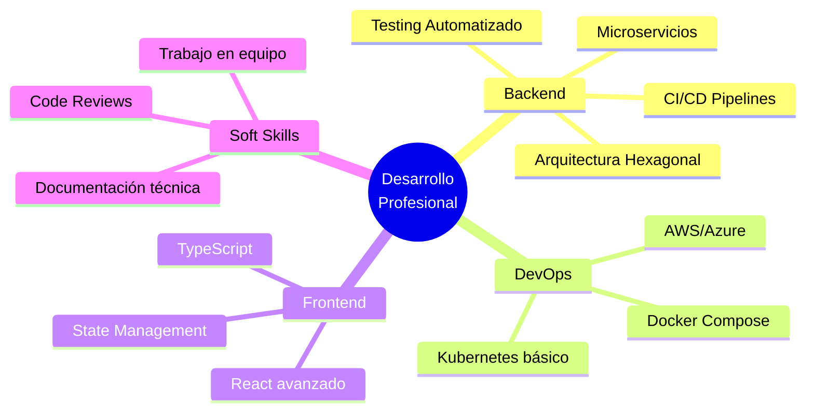

<!--
INSTRUCCIONES DE USO:
1. Crea un repositorio público llamado: nsilcre (tu nombre de usuario)
2. Añade un archivo README.md con este contenido
3. Ajusta los enlaces de LinkedIn y cualquier info personal
4. ¡Tu perfil se verá automáticamente en tu página de GitHub!
-->

<div align="center">
  
</div>

<div align="center">
  
  [](https://git.io/typing-svg)
  
</div>

<div align="center">
  
  [](https://github.com/nsilcre)
  [](mailto:nsilvacremona@gmail.com)
  [](https://github.com/nsilcre)
  <!-- Añade tu LinkedIn aquí -->
  <!-- [](TU_URL_LINKEDIN) -->
  
</div>

---

## 👨‍💻 Sobre mí

> *"El código es poesía, pero solo si alguien más puede leerlo"*

Soy **Nicolás Silva**, estudiante de **2º DAW** (Desarrollo de Aplicaciones Web) y **Técnico en Sistemas Microinformáticos y Redes**. Mi enfoque está en el **desarrollo backend** y la creación de soluciones robustas, escalables y mantenibles.

- 🎯 **Especialización:** Desarrollo Backend (APIs REST, Autenticación, Arquitectura)
- 🔧 **Stack principal:** Laravel, Django/Flask, Node.js
- 🌱 **Aprendiendo:** Docker, CI/CD, Testing, Arquitectura de Software
- 💡 **Filosofía:** Código limpio > Código complejo
- 🏋️ **Fuera del código:** Deporte y nutrición para mantener el foco

---

## 🛠️ Stack Tecnológico

<div align="center">

### Backend


### Frontend


### Bases de Datos


### Herramientas & DevOps


</div>

---

## 🚀 Proyectos Destacados

<table>
<tr>
<td width="50%">

### 🔐 CRUD Laravel
Sistema completo de gestión con Laravel
- **Stack:** Laravel, MySQL, Blade
- **Features:** CRUD completo, validación, arquitectura MVC
- **Aprendizajes:** Eloquent ORM, migraciones, seeders

[](https://github.com/nsilcre/CRUD_LARAVEL)

</td>
<td width="50%">

### 🌐 API RESTful
API REST profesional con Laravel
- **Stack:** Laravel, MySQL
- **Features:** Endpoints RESTful, autenticación, respuestas JSON
- **Aprendizajes:** API Resources, middleware, HTTP status codes

[](https://github.com/nsilcre/API-RESTful)

</td>
</tr>

<tr>
<td width="50%">

### 📝 Ejercicios PHP
Colección de ejercicios de DWES
- **Stack:** PHP puro
- **Contenido:** Ejercicios de 2º DAW 2025/2026
- **Aprendizajes:** Fundamentos PHP, buenas prácticas

[](https://github.com/nsilcre/Ejercicios_php)

</td>
<td width="50%">

### 🔑 Sistema de Login
Autenticación y gestión de usuarios
- **Stack:** PHP, CSS
- **Features:** Login, registro, sesiones
- **Aprendizajes:** Seguridad, hash de contraseñas, validación

[](https://github.com/nsilcre/Login)

</td>
</tr>
</table>

---

## 📈 Estadísticas de GitHub

<div align="center">
  
  
</div>

<div align="center">
  
</div>

<div align="center">
  
</div>

---

## 🎯 Objetivos 2025



---

## 💼 Principios de Desarrollo

```typescript
const myPrinciples = {
  code: {
    philosophy: "Clean Code > Clever Code",
    priority: "Legibilidad y mantenibilidad",
    testing: "Si no tiene tests, no está terminado"
  },
  workflow: {
    versionControl: "Git Flow",
    commits: "Convencionales y descriptivos",
    documentation: "El código se lee más de lo que se escribe"
  },
  learning: {
    approach: "Learning by doing",
    feedback: "Iteración rápida y mejora continua",
    collaboration: "El mejor código se escribe en equipo"
  }
};
```

---

## 🌟 En qué estoy trabajando ahora

- 🔨 **Proyecto actual:** API REST con autenticación JWT en Laravel
- 📚 **Aprendiendo:** Testing con PHPUnit y arquitectura hexagonal
- 🎓 **Estudiando:** Docker para entornos de desarrollo consistentes
- 💡 **Próximo objetivo:** Implementar CI/CD en mis proyectos

---

## 📊 Actividad Reciente

<!--START_SECTION:activity-->
<!--END_SECTION:activity-->

---

## 🤝 Colaboración

¿Tienes un proyecto interesante? ¿Quieres colaborar en algo? ¡Me encantaría saber de ti!

- 💬 Abierto a colaboraciones en proyectos educativos
- 🌱 Siempre dispuesto a aprender y compartir conocimiento
- 🔍 Interesado en contribuir a proyectos open source

---

## 📫 Contacto

<div align="center">

[](mailto:nsilvacremona@gmail.com)
[](https://github.com/nsilcre)
<!-- Añade tu LinkedIn -->
<!-- [](TU_URL) -->

**Respondo en menos de 24h** ⚡

</div>

---

## 💡 Quote del día

<div align="center">


</div>

---

<div align="center">
  
  
  ### ⭐ Si te gusta mi trabajo, no dudes en dar una estrella a mis repositorios
  
  
  
  
</div>
